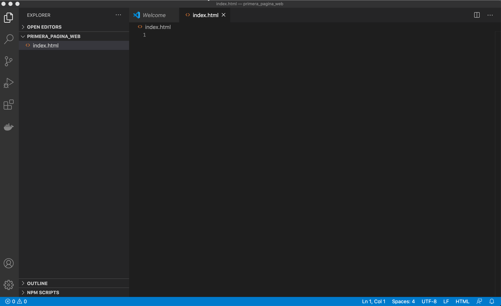
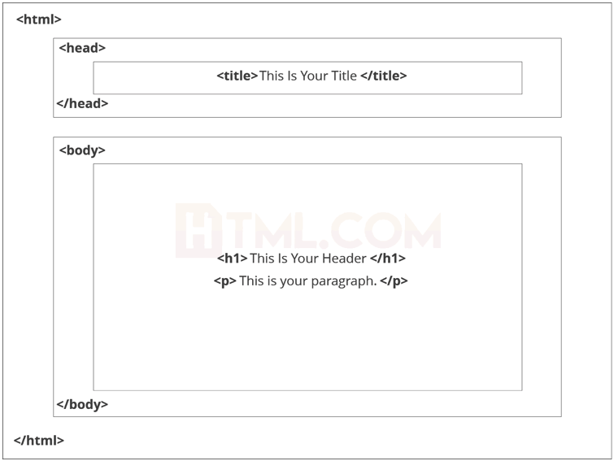

# intro-desarrollo-web
En este repositorio vas a encontrar recursos para aprender los temas mas básicos de HTML, CSS y GIT.

<hr />

## Objetivos
Despues de leer este tutorial deberías tener un mejor conocimiento de qué es HTML, CSS y GIT. No vas a ser un experto en ninguna de estas tecnologías pero vas a encontrar links a varios cursos y tutoriales que te pueden ayudar a mejorar.


### Editor de código
Existen muchos editores muy buenos para trabajar con HTML, como sublime, Komodo, Geany entre otros. Para este tutorial usaremos visual studio code ya que va a ser útil más tarde en la parte de git.

En este link puedes [descargar](https://code.visualstudio.com/download) VS code.

Una vez lo descargues puedes explorar [extenciones](https://www.elegantthemes.com/blog/wordpress/top-vs-code-extensions-for-web-developers) útiles.


### Primeros pasos
Primero que todo, crea una carpeta en tu computador con cualquier nombre. Dentro de esa carpeta crea un archivo con nombre index.html (en realidad puede tener cualquier nombre el archivo mientras tenga la extencion .html, pero index es la costumbre para página principal).

Abre esa carpeta usando visual studio code. deberías tener algo como esto.



Todo lo que sigue en este tutorial puedes recrearlo en este archivo para ver los resultados tu mismo. Para abrir tu página en el navegador, peudes hacer doble click en el archivo en el explorador de archivos, o escribir el path en el navegador, por ejemplo:
> file://C:/Documents/primera_pagina_web/index.html

<hr />

## HTML
Este es el lenguaje en el cual la mayoría de páginas están escritas. Sus siglas significan **hypertext markup language**. El HTML define la estructura de una página web, mas no su estilo, para eso existe el CSS (que va a aparecer mas tarde en este tutorial). 

[Este](https://html.com) es un buen recurso para ver la información más a fondo.

### Etiquetas
Una etiqueta se utiliza para demarcar un elemento. Estas están encerradas entre **<** y **>** y suelen tener una etiqueta de apertura y una de cerrado. Por ejemplo, la etiqueta que muestra un título es 

```
<h1>
    este es un titulo
</h1>
```

En este ejemplo `<h1>` es la etiqueta de apertura, es texto `este es un titulo` es el contenido y `</h1>` es la etiqueta de cerrado. Casi todas las etiquetas necesitan ser cerradas, la forma en la que se representa la etiqueta de cerrado es con el `/` antes del nombre de la etiqueta.

Las etiquetas pueden tener más etiquetas anidadas dentro de ellas como se va a ver más adelante.

Esta es una [lista](https://www.w3schools.com/tags/default.asp) de varias etiquetas de HTML. Cada una tiene una función específica. Es importante recordar que las etiquetas añaden funcionalidad y estructura a la página, mas no estilo.

### Estructura
Esta es la estructura básica que deben tener las páginas construidas con HTML.



Primero `<!DOCTYPE html>` define el lenguaje que se utilizará (en este caso, HTML). 

`<html>` especifica que ahora empezaremos a escribir en HTML.

`<head>` contiene el título y metadata que especificará cosas como la hoja de estilos que se va a utilizar (lo cual veremos mas adelante), palabras clave para que los buscadores encuentren contenido de la página,  descripciones, el nombre del autor etc. [Aqui](https://www.w3schools.com/html/html_head.asp) puedes encontrar más información.

`<body>` Dentro de esta etiquetá irá todo el cuerpo de nuestra página. Esto incluye textos, imagenes, tablas, listas etc.

A continuación un ejemplo de de una página muy simple.

```
<!DOCTYPE html>
<html>
<head>
  <title>El titulo de mi pagina</title>
  
</head>
<body>

    <h1>Mi primer titulo</h1>

    <p>Mi primer parrafo</p>

</body>
</html>
```


### Atributos
Es información extra que se le da a una etiqueta. Se escribe en la etiqueta de apertura. Una etiqueta puede tener cero o varios atributos.

Por ejemplo, la etiqueta `` sirve para pintar una imagen dentro de la página, pero esta necesita información extra para saber qué imagen es la que se va a pintar.

``````


Acá el atributo `src` le indica a la etiqueta `img` la ruta de la imagen (esta puede ser una URL o una ruta dentro del mismo proyecto).
La etiqueta `alt` el texto alternativo de la imagen.


**Siempre recuerda!** 
- Casi todas (pero no todas) las etiquetas necesitan ser abiertas y cerradas. por ejemplo `<etiqueta> </etiqueta>`

- Pueden anidarse etiquetas una dentro de otra, y siempre es neceasrio cerrarlas en el mismo orden en que se abrieraon. 

- Es buena práctica identar cuando se abre una etiqueta dentro de otra para mantener el orden y la jerarquia de los elementos. Por ejemplo.

```
<body>
    
    <p>
        este es un titulo.
        <b>Este es un texto en negrilla</b>
    </p>
</body>

```

Es equivalente a:

<hr/>


<p>
    este es un titulo.
    <b>Este es un texto en negrilla</b>
</p>


<hr />

### Formularios

Uno de los usos más comunes en las páginas web, son los formularios. Estos están definidos con la etiqueta `<form>` y dentro pueden tener varios  elementos para ingresar diferentes datos.

Por ejemplo, el siguiente código:


```

<form>
    <input type="text" placeholder="nombre">
    <br>
    <input type="text" placeholder="apellido"> 
    <br>
    <input type="text" 
    placeholder="pais"> 
    <br>
    <input type="password" placeholder="contraseña"> 
    <br>
    <input type="password" placeholder="contraseña"> 
    <br>
    <select name="carrera"> 
        <option value="sis">Ingenieria de sistemas</option> 
        <option value="ind">Ingenieria industrial</option>
        <option value="blue">Ingenieria electronica</option>
       <option value="black">Ingenieria civil</option>
    </select> 
    <br>
    <input type="radio" id="male" name="gender" value="male">
    <label for="male">Male</label><br>
    <input type="radio" id="female" name="gender" value="female">
    <label for="female">Female</label><br>
    <input type="radio" id="other" name="gender" value="other">
    <label for="other">Other</label>
    <br>
    <input type="submit" value="entrar"> 
</form>
```

Genera el siguiente formulario:

<form>
    <input type="text" name="nombre" placeholder="nombre">
    <br>
    <input type="text" name="apellido" placeholder="apellido"> 
    <br>
    <input type="text" name="pais"
    placeholder="pais"> 
    <br>
    <input type="password" name="contra" placeholder="contraseña"> 
    <br>
    <input type="password" name="verificar" placeholder="contraseña"> 
    <br>
    <select name="carrera"> 
        <option value="sis">Ingenieria de sistemas</option> 
        <option value="ind">Ingenieria industrial</option>
        <option value="blue">Ingenieria electronica</option>
       <option value="black">Ingenieria civil</option>
    </select> 
    <br>
    <input type="radio" name="genero" value="masculino">
    <label for="masculino">Masculino</label><br>
    <input type="radio" id="femenino" name="genero" value="femenino">
    <label for="femenino">Femenino</label><br>
    <input type="radio" id="otro" name="genero" value="otro">
    <label for="other">Otro</label>
    <br>
    <input type="submit" value="entrar"> 
</form>


**CUIDADO!** acá utilizamos la etiqueta `<br>` que significa break line para mostrar todos los elementos verticalmente, esto debe evitarse ya que es una etiqueta obsoleta, pues como dijimos antes, HTML solo debería especificar la funcinoalidad y la estructuram no el estili. Hace años cuando HTML aun era nueva, esta etiqueta era bastante común, ahora, debería usarse CSS para cambiar el estilo. 


### links útiles
- [tutorial básico de html](https://html.com)
- [porqué `<br>` es obsoleto](https://developer.mozilla.org/en-US/docs/Web/HTML/Element/br)
- [listas](https://html.com/tags/li/)
- [tablas](https://html.com/tags/table/)
-  [formularios](https://html.com/forms/)
- [documentacion sobre etiquetas](https://www.w3schools.com/tags/ref_byfunc.asp)
- [historia de html](https://www.yourhtmlsource.com/starthere/historyofhtml.html)


