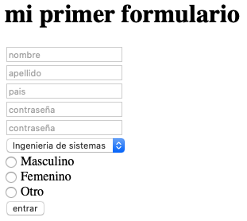

# intro-desarrollo-web
En este repositorio vas a encontrar recursos para aprender los temas mas básicos de HTML, CSS y GIT.

<hr />

## Objetivos
Despues de leer este tutorial deberías tener un mejor conocimiento de qué es HTML, CSS y GIT. No vas a ser un experto en ninguna de estas tecnologías pero vas a encontrar links a varios cursos y tutoriales que te pueden ayudar a mejorar.


### Editor de código
Existen muchos editores muy buenos para trabajar con HTML, como sublime, Komodo, Geany entre otros. Para este tutorial usaremos visual studio code ya que va a ser útil más tarde en la parte de git.

En este link puedes [descargar](https://code.visualstudio.com/download) VS code.

Una vez lo descargues puedes explorar [extenciones](https://www.elegantthemes.com/blog/wordpress/top-vs-code-extensions-for-web-developers) útiles.

[Estas](https://docs.google.com/document/d/e/2PACX-1vQDcdmrkjNPlOSeqS-v99P-57h5f7Yo3pszkko1sN6OtIVlNBFgTyeTX3A1mDSOdw1Ugb1l5o0NVy-a/pub) son otras extenciones muy útiles.

### Primeros pasos
Primero que todo, crea una carpeta en tu computador con cualquier nombre. Dentro de esa carpeta crea un archivo con nombre index.html (en realidad puede tener cualquier nombre el archivo mientras tenga la extencion .html, pero index es la costumbre para página principal).

Abre esa carpeta usando visual studio code. deberías tener algo como esto.


Todo lo que sigue en este tutorial puedes recrearlo en este archivo para ver los resultados tu mismo. Para abrir tu página en el navegador, peudes hacer doble click en el archivo en el explorador de archivos, o escribir el path en el navegador, por ejemplo:
> file://C:/Documents/primera_pagina_web/index.html


## links útiles
- [descargar vs code](https://code.visualstudio.com/download)
- [Extensiones de vs code](https://docs.google.com/document/d/e/2PACX-1vQDcdmrkjNPlOSeqS-v99P-57h5f7Yo3pszkko1sN6OtIVlNBFgTyeTX3A1mDSOdw1Ugb1l5o0NVy-a/pub)
- [más extensiones de vs code](https://www.elegantthemes.com/blog/wordpress/top-vs-code-extensions-for-web-developers)

<hr />


# HTML
Este es el lenguaje en el cual la mayoría de páginas están escritas. Sus siglas significan **hypertext markup language**. El HTML define la estructura de una página web, mas no su estilo, para eso existe el CSS (que va a aparecer mas tarde en este tutorial). 

[Este](https://html.com) es un buen recurso para ver la información más a fondo.

[CS50](https://www.youtube.com/watch?v=78wdlyzrKOA) es el curso introductorio a programación web de Harvard donde hablan un poco de HTML.

## Etiquetas
Una etiqueta se utiliza para demarcar un elemento. Estas están encerradas entre **<** y **>** y suelen tener una etiqueta de apertura y una de cerrado. Por ejemplo, la etiqueta que muestra un título es 

```
<h1>
    este es un titulo
</h1>
```

En este ejemplo `<h1>` es la etiqueta de apertura, es texto `este es un titulo` es el contenido y `</h1>` es la etiqueta de cerrado. Casi todas las etiquetas necesitan ser cerradas, la forma en la que se representa la etiqueta de cerrado es con el `/` antes del nombre de la etiqueta.

Las etiquetas pueden tener más etiquetas anidadas dentro de ellas como se va a ver más adelante.

Esta es una [lista](https://www.w3schools.com/tags/default.asp) de varias etiquetas de HTML. Cada una tiene una función específica. Es importante recordar que las etiquetas añaden funcionalidad y estructura a la página, mas no estilo.

## Estructura
Esta es la estructura básica que deben tener las páginas construidas con HTML.


Primero `<!DOCTYPE html>` define el lenguaje que se utilizará (en este caso, HTML). 

`<html>` especifica que ahora empezaremos a escribir en HTML.

`<head>` contiene el título y metadata que especificará cosas como la hoja de estilos que se va a utilizar (lo cual veremos mas adelante), palabras clave para que los buscadores encuentren contenido de la página,  descripciones, el nombre del autor etc. [Aqui](https://www.w3schools.com/html/html_head.asp) puedes encontrar más información. Por ejemplo, si no especificas que se utilizará UTF-8, no podrás usar la letra **ñ**. Puedes hacerlo con la etiqueta `<meta charset="UTF-8">` dentro de la etiqueta `<head>`.

`<body>` Dentro de esta etiquetá irá todo el cuerpo de nuestra página. Esto incluye textos, imagenes, tablas, listas etc.

A continuación un ejemplo de de una página muy simple.

```
<!DOCTYPE html>
<html>
<head>
  <title>El titulo de mi pagina</title>
  
</head>
<body>

    <h1>Mi primer titulo</h1>

    <p>Mi primer parrafo</p>

</body>
</html>
```


## Atributos
Es información extra que se le da a una etiqueta. Se escribe en la etiqueta de apertura. Una etiqueta puede tener cero o varios atributos.

Por ejemplo, la etiqueta `` sirve para pintar una imagen dentro de la página, pero esta necesita información extra para saber qué imagen es la que se va a pintar.

``````


Acá el atributo `src` le indica a la etiqueta `img` la ruta de la imagen (esta puede ser una URL o una ruta dentro del mismo proyecto).
La etiqueta `alt` el texto alternativo de la imagen.

Existen bastantes atributos que no deberían usarse ya que no definen la funcionalidad sino el estilo, por ejemplo, se puede especificar el ancho y el alto de la imagen así:

```

```


**Siempre recuerda!** 
- Casi todas (pero no todas) las etiquetas necesitan ser abiertas y cerradas. por ejemplo `<etiqueta> </etiqueta>`

- Pueden anidarse etiquetas una dentro de otra, y siempre es neceasrio cerrarlas en el mismo orden en que se abrieraon. 

- Es buena práctica identar cuando se abre una etiqueta dentro de otra para mantener el orden y la jerarquia de los elementos. Por ejemplo.

```
<body>
    
    <p>
        este es un titulo.
        <b>Este es un texto en negrilla</b>
    </p>
</body>

```

Es equivalente a:


<p>
    este es un titulo.
    <b>Este es un texto en negrilla</b>
</p>


<hr />

## Anchor tag
Junto al atributo hrf, esta crea un vínculo a otra página de internet.

por ejemplo
```
<a href="https://www.google.com/"> Link a google </a>

```

crea un link que cuando se le haga click, enviará a google.com

El atributo `href` puede recibir links o rutas relativas dentro del proyecto. [Aquí](https://stackoverflow.com/questions/24028561/relative-path-in-html) puedes encontrar más información sobre eso.

## Formularios

Uno de los usos más comunes en las páginas web, son los formularios. Estos están definidos con la etiqueta `<form>` y dentro pueden tener varios  elementos para ingresar diferentes datos.

Por ejemplo, el siguiente código:


```
<h1>
    mi primer formulario
</h1>
<form>
    <input type="text" placeholder="nombre">
    <br>
    <input type="text" placeholder="apellido"> 
    <br>
    <input type="text" 
    placeholder="pais"> 
    <br>
    <input type="password" placeholder="contraseña"> 
    <br>
    <input type="password" placeholder="contraseña"> 
    <br>
    <select name="carrera"> 
        <option value="sis">Ingenieria de sistemas</option> 
        <option value="ind">Ingenieria industrial</option>
        <option value="blue">Ingenieria electronica</option>
       <option value="black">Ingenieria civil</option>
    </select> 
    <br>
    <input type="radio" id="male" name="gender" value="male">
    <label for="male">Male</label><br>
    <input type="radio" id="female" name="gender" value="female">
    <label for="female">Female</label><br>
    <input type="radio" id="other" name="gender" value="other">
    <label for="other">Other</label>
    <br>
    <input type="submit" value="entrar"> 
</form>
```

Genera el siguiente formulario:




**CUIDADO!** acá utilizamos la etiqueta `<br>` que significa break line para mostrar todos los elementos verticalmente, esto debe evitarse ya que es una etiqueta obsoleta, pues como dijimos antes, HTML solo debería especificar la funcinoalidad y la estructura no el estilo. Hace años cuando HTML aun era nueva, esta etiqueta era bastante común, ahora, debería usarse CSS para cambiar el estilo. 


## links útiles
- [curso de desarrollo web](https://www.appbrewery.co/p/web-development-course-resources) (muy recomendado)
- [curso CS50 de harvard](https://www.youtube.com/watch?v=78wdlyzrKOA) (super recomendado)
- [tutorial básico de html](https://html.com)
- [porqué `<br>` es obsoleto](https://developer.mozilla.org/en-US/docs/Web/HTML/Element/br)
- [listas](https://html.com/tags/li/)
- [tablas](https://html.com/tags/table/)
-  [formularios](https://html.com/forms/)
- [documentacion sobre etiquetas](https://www.w3schools.com/tags/ref_byfunc.asp)
- [historia de html](https://www.yourhtmlsource.com/starthere/historyofhtml.html)
- [etiquetas que van dentro de head](https://www.w3schools.com/html/html_head.asp)
- [lista de etiquetas](https://www.w3schools.com/tags/default.asp)
- [rutas relativas](https://stackoverflow.com/questions/24028561/relative-path-in-html)


## Ejercicio

Intenta recrear esta página utilizando lo que has aprendido (los nombres son links a las paginas de wikipedia de los actores).


## Resumen
HTML utiliza etiquetas y atributos para definir la funcionalidad y la estructura de la página. Estas siguen una sintaxis que permite anidar etiquetas en el cuerpo de otras etiquetas. Existen elementos obsoletos que no deben ser utilizados como la etiqueta `<br>`. 
A continuación veremos cómo agregarle estilo a nuestra página por medio de CSS.

<br>

# CSS
CSS o Cascading Style Sheets permite agregarle estilo a a la página. Podemos utilizarlo para estilizar elementos específicos del HTML.
[Este](https://scrimba.com/learn/introtocss) es un muy buen curso graties para iniciar a aprender.

[Curso](https://www.youtube.com/watch?v=g7nZFp2zSJ4)  de Harvard sobre CSS 


## Inline CSS

La forma más facil (y menos recomendable) de estilizar, es utilizando el atributo `style` dentro del mismo HTML. Por ejemplo:

```
<h1 style="color: red;"> Este es un texto rojo! </h1>
```
Acá tomamos la propiedad *color* de nuestro título y le asignamos el color rojo.
Sólamente este elemento será de color rojo, esta no es una forma escalable de agregarle estilo a nuestra página, por lo que no es nada recomendable.

## Interno

Entre la etiqueta `<head>` se puede definir el estilo con la etiqueta `<style>`. Por ejemplo:

```
<head>  
    <style>  
        h1 {  
            color: red;  
        }  
    </style>  
</head>
```

En este ejemplo se le está asignando el color rojo a todos los elementos `<h1>` del archivo. 


## Externo

Esta es la forma más recomendada para agregarle estilo a nuestra página. Con un archivo externo con extensión CSS en el que se definen todos los estilos. Este archivo se importa desde el HTML utilizando la etiqueta `<link>` entre la etiqueta `<head>`.

```
<head>  
    <link rel="stylesheet" href="style.css">  
</head>
```
Ahora, en la misma carpeta en que creaste tu archivo index.html crea un archivo vacio llamado style.css.

Un archivo CSS está compuesto de varias reglas. Cada regla tiene un **selector** cada selector tiene una o varias **propiedades** y cada propiedad tiene un **valor**.

El conjuto de propiedades va despues del selector entre corchetes {}.

Cada propiedad se separa de su valor con dos puntos **(:)**  y despues de el valor se escribe punto y coma **(;)**

Por ejemplo:

```
h1 {  
    color: red;  
    background-color: black;
} 

```

`h1` es el Selector.<br>
`color` es una propiedad a la cual se le asigna el valor `red`.

`background-color` es otra propiedad a la cual se le asigna la propiedad `black`.

En este caso estamos indicando que todos los elementos `<h1>` en nuestra página, ya no van a ser negros como lo son por default, sino ahora serán rojos y el color del fondo será negro.

### Clases
Sin embargo, muchas veces no queremos que todos elementos iguales tengan exactamente el mismo estilo. Muchas veces queremos agrupar en diferentes clases elementos parecidos.

Otra forma de seleccionar elementos para agregarles estilos es mediante clases. Para eso debemos agregarle el atributo class a la etiqueta en html. Para declarar una clase en el archivo css se utiliza un pnto antes del nombre de la clase.

por ejemplo:

*style.css*
```
.titulo-rojo{
    color: red;
}
```
Al agregar esta regla en nuestro CSS, todos los elementos del HTML que sean de la clase *titulo-rojo* serán de color rojo.
Para asignarle una clase a un elemento se utiliza el atributo class así:

*index.html*
```
<h1 class="titulo-rojo">
    Quiero que este titulo sea rojo 
</h1>

<h1 class="titulo-rojo">
    Tambien quiero que este sea rojo
</h1>

<h1>
    pero no quiero que este sea rojo :)
</h1>
```

## ID
Las clases son buenas para agrupar elementos con estilos similares, pero si queremos darle estilo a un elemto en específico, utilizamos los ID.
Estos se definen en el CSS con un **#** antes del id, y en el html con el atributo **id**.

- Los ID deberían ser únicos dentro de la página.
- Si un elemento tiene una clase y un ID asociado, toma todas las reglas de la clase y ademas todas las del ID.
- El ID tiene jerarquia mayor a la de la clase.

Por ejemplo:

>style.css*
```
.titulo-rojo{
    color: red;
}

#titulo-principal{
    text-decoration: underline;
}
```


>index.html*
```
<h1 class="titulo-rojo" id="titulo-principal">
    Titulo rojo y subrayado
</h1>

<h1 class="titulo-rojo">
    titulo rojo
</h1>

<h1>
    este es el titulo por default
</h1>
```

Si empiezas a jugar con las reglas y diferentes combinaciones de clases y id, notarás que si hay propiedades que se contradigan entre la clase y el ID, el elemento tomará lo que diga el ID pues tiene mayor jerarquia.

[Acá](https://www.tutorialrepublic.com/css-reference/css3-properties.php) encontrarás muchas propiedades que le puedes aplicar a diferentes etiquetas.

Existen más selectores ademas del ID y de la clase, [acá](https://developer.mozilla.org/en-US/docs/Learn/Getting_started_with_the_web/CSS_basics#different_types_of_selectors) podrás ver cuales son y como utilizarlos.

Existen muchísimas propiedades que se pueden utilizar para estilizar una página web, [acá](https://css-playground.com/view/45/css-gradient-playground) puedes ver algunas de ellas y como implementarlas.

## DIV
Existe una etiqueta muy útil en html que no hemos visto aun, ya que sin css no es muy interesante. La etiqueta `<div>` es un contenedor, permite anidar más elementos html dentro de él y organizar los elementos en unidades lógicas.

Puedes ver más información en [este](https://www.youtube.com/watch?v=-XQlr727A8w) video.


Por ejemplo, considera el siguiente código. Cambia un poco los estilos para explorar todas propiedades que se le pueden agregar a los divs.

>style.css
```
div{
    border: solid;
    margin-bottom: 30px;;
}
.section{
    border-color: blue;
}
#nav-bar{
    padding: 10px;
    border-color: red;
}
#nav-image{
    width: 70px;
    height: 70px;
    cursor: pointer;
}
```

>index.html

```
<!DOCTYPE html>
<html>
    <head >
        <meta charset="UTF-8">
        <title> Example web page</title>
        
    </head>
    <body>
        <div id="nav-bar">
            
            Esta es una barra de navegación muy feita
        </div>
        <div class="section">
            <h1>Sección 1</h1>
            <p>Este es un parrafo que esta en la seccion 1</p>
        </div>
        <div class="section">
            <h1>Sección 2</h1>
            <p> Este es un parrafo que esta en la seccion 2</p>
        </div>
    </body>
</html>
```


## links útiles
- [curso de desarrollo web](https://www.appbrewery.co/p/web-development-course-resources) (recomendadísimo)
- [CSS basico](https://developer.mozilla.org/en-US/docs/Learn/Getting_started_with_the_web/CSS_basics)
- [CSS basico](https://www.w3schools.com/css/)
- [tutorial de CSS](https://www.freecodecamp.org/news/get-started-with-css-in-5-minutes-e0804813fc3e/)
- [Harvard CS50](https://www.youtube.com/watch?v=YoXxevp1WRQ&list=PLhQjrBD2T382_R182iC2gNZI9HzWFMC_8)
- [Divs](https://www.youtube.com/watch?v=-XQlr727A8w)
- [playground](https://css-playground.com/view/45/)
- [Selectores](https://developer.mozilla.org/en-US/docs/Learn/Getting_started_with_the_web/CSS_basics#different_types_of_selectors)

## Ejercicio
Intenta replicar este fragmento de la página de github.


Ten en cuenta que
- los botones cambian de color cuando tienen el cursos encima
- la tipografía 
- intenta ser lo más organizado posible para no utilizar más clases e IDs de lo necesario.


## Resumen
- El CSS está compuesto de reglas y sirve para agregarle estilo a la página.
- Una regla está ompuesta por varias propiedades, a cada propieddad se le asigna un valor.
- Hay tres formas de agregarle CSS a un html pero la más recomendable es utilizando un archivo externo.
- Un buen estilo utiliza la mejor combinación de clases, ids y selectores para darle consistencia a la estructura del sitio web.


<hr/>

# Git
Git es una herramienta que permite trabajar colaborativamente en el mismo proyecto, mantener versionamiento para revertir a versiones anteriores y crear ramas en las cuales se puedan experimentar. Sin herramientas de versionamiento como git, sería imposible sacar adelante proyectos de software complejos.
Existen varias herramientas basadas en git que permiten subir los repositorios a servidores centralizados, tal vez la más usada es [github](https://github.com). Si no tienes una cuenta de github, puedes abrirla gratis en la página.

[Este]( https://cs50.harvard.edu/web/2020/weeks/1/) curso explica muy bien las funciones más importantes de git, **Termina de ver este video antes de seguir con el turorial**

Al final de este tutorial vas a contribuir a este mismo proyecto de github, agregando un archivo de html y modificando un archivo ya existente en el proyecto. Aunque git es una herramienta que se trabaja por consola hay varios programas que ayudan con interfaces gráficas para ayudar a la visualización. De hecho la mayoría de editores de código tienen herramientas para hacer funciones básicas sin la necesidad de utilizar la consola. Por ejemplo, [acá](https://code.visualstudio.com/docs/editor/github) encontrarás como hacerlo con visual studio code.
Es recomendable primero aprender a trabajar con la consola para aprender bien los conceptos antes de utilizar estas herrramientas, por eso cubriremos los comandos por consola en este tutorial.


### instalar git
Para instalar git puedes seguir las instrucciones de [este](https://git-scm.com/book/en/v2/Getting-Started-Installing-Git) sitio dependiendo de tu sistema operativo.

### Terminal en VScode
Para ingresar los comandos puedes utilizar la terminal del computador o puedes utilizar la [terminal integrada](https://code.visualstudio.com/docs/editor/integrated-terminal) en visual studio code.

## Qué es un repositorio?
Es una carpeta que guarda nuestro código e información acerca de nuestro código como por ejemplo los cambios que se han hecho, las diferentes versiones, quienes han hecho los diferentes cambios en archivos etc.

Github guarda repositorios para que podamos descargarlos, manipularlos y volver a subirlos desde cualquier lado.


## Clone

El primer comando que veremos es `git clone` este permite descargar un repositorio en tu computador.
para esto, en cualquier carpeta de tu computador, y despues de haber instalado git, ingresa el comando `git clone` seguido de la url del repositorio. Por ejemplo, para clonar el repositorio en el que se encuentra este tutorial escribe
>git clone https://github.com/CapituloJaverianoACM/intro-desarrollo-web.git

Esto descargará una carpeta (en este caso llamada intro-desarrollo-web), este es el repositorio. 
usando
>cd intro-desarrollo-web

Cambiarás a la carpeta que acabas de descargar. Ahora, con el comando

>ls

Podrás ver todos los archivos y carpetas en el repositorio.


Felicitaciones! acabas de clonar un repositorio.

## Commits
Un commit es un estado del proyecto que se guarda en el repositorio. Básicamente es la forma de decirle a git que queremos gardar el estado actual del proyecto pues es un estado relevante o una version que vale la pena mantener al menos hasta tener una nueva versión.

Al trabajar en un proyecto, una vez se llegue a un estado que se quiera guardar, con el comando `git add <archivo>` 

para hacer commit, primero debes agregar los archivos al "staging area". Con el comando `git add <archivos>` puedes agregar los archivos que quieras a esta area. Para agregar todos los archivos puedes usar 
> git add .

Para ver el estado puedes usar 

>git status

Ahi podrás ver que archivos están en el staging area listos para el commit.
Por último puedes hacer el commit con.

>git commit -m "Este debe ser un mensaje explicativo de los cambias que se han hecho en este commit"

si vuelves a escribir

>git status

Vas a notar que el staging area está vacia otra vez.

### Ramas
Una de las funcionalidades más importantes de los sistemas de versionamiento es poder utilizar ramas o "branches" para no afectar el código en una rama diferente. Por default todos los repoisitorios tienen una rama principal llamada "main".

[Acá ](https://www.youtube.com/watch?v=iJKIxrJ40ss&t=77s) puedes ver mas sobre ramas. 

Por ejemplo, si estamos parados en la rama main y escribimos 
>git branch -l

nos mostrará todas las ramas que hay actualmente.

Al escribir
>git branch nueva-rama

Crearemos una nueva rama con el nombre `nueva-rama` **pero aun estamos en main**. para cambiar a una rama diferente (por ejemplo a nueva-rama) se utiliza el comando checkout, asi:

>git checkout nueva-rama

para confirmar, puedes escribir otra vez 

>git branch -l
 y verás que ahora estás en la nueva rama.

 Has commit antes de cambiarte de una rama a otra para no perder el progreso. Tambien podrías usar otras técnicas en vez de hacer commit para no perder el progreso, pero eso va mas alla de este tutorial, hay más información [aquí](https://git-scm.com/docs/git-stash).

Es recomendable trabajar en diferentes ramas si hay múltiples desarrolladores en el mismo proyecto para evitar problemas. Además, en es necesario pactar una política para manejar las ramas, por ejemplo, que cada desarrollador siempre trabaje en una rama con su nombre y cada vez que tenga cambios significativo.


## Push
hasta ahora, Todos los cambios que hagas (todos los commits) solo se haran localmente, es decir que el repositorio en github no verá ningun cambio hasta que no hagas push de tus cambios. Para esto utilizas es comando `git push` seguido del servidor al cual vas a hacer los cambios y de la rama. Por ejemplo

>git push origin nueva-rama

Subirá al servidor de github los commits que hasta ahora eran locales en la rama nueva-rama.

*origin es el nombre que se le da al repositorio remoto*

## merge
Este comando permite unir dos ramas. Por ejemplo, si estoy parado en la rama `main`. De esta manera:


 y escribo

>git merge nueva-rama

Los commits de la nueva rama quedarían unidos a la rama principal, así:


## pull
Para obtener la version mas actualizada del repositorio, basta con escribir

>git pull
 
Esto descargará en tu computador todos los cambios que haya en el servidor remoto que aun no se vean reflejados localmente.


## pull request
Ahora.... supongamos que varios desarrolladores han trabajado cada uno en sus ramas diferentes.... Cómo juntan todo el trabajo? La forma más fácil, más organizada y mas recomendable es hacer un [pull request](https://www.youtube.com/watch?v=oFYyTZwMyAg). Esto le informará al dueño del repositorio que alguien quiere hacer un cambio y él podrá aceptarlo o rechazarlo. Además permite que compañeros del equipo revisen el código y hagan correciones.


Para esto, debes trabajar en una rama separada, hacerle push a esa rama y luego utilizar, ya sea github desktop o el sitio web de github, para hacer un pull request.

## Pasos

- Abre una cuenta gratis en github
- clona el repositorio
- crea una rama con tu nombre
- modifica el archivo index.html para agregar un boton que lleve a tu página
- crea tu página en un archivo html con tu nombre y apellido por ejemplo: *juan_perez.html*
- añade tus cambios, haz un commit
- haz un pull request para incorporar tus cambios a la rama principal.


## Link útiles

- [CS50 de harvard](https://cs50.harvard.edu/web/2020/weeks/1/)
- [curso en udemy gratis](https://www.udemy.com/course/git-started-with-github/?utm_source=adwords&utm_medium=udemyads&utm_campaign=DSA_Catchall_la.EN_cc.ROW&utm_content=deal4584&utm_term=_._ag_88010211481_._ad_437497337004_._kw__._de_c_._dm__._pl__._ti_dsa-406594358574_._li_1003659_._pd__._&matchtype=b&gclid=CjwKCAiA9vOABhBfEiwATCi7GIS4w_5dY-AdXRuhikIm5PQ2ttjcZYMe_aGIKKvSgdu9ED5ZiDQeIhoC60EQAvD_BwE)
- [github en vscode](https://code.visualstudio.com/docs/editor/github)
- [cheat sheet de comandos de git](https://training.github.com/downloads/github-git-cheat-sheet.pdf)
- [terminal integrada en vscode](https://code.visualstudio.com/docs/editor/integrated-terminal)
- [pull requests](https://www.youtube.com/watch?v=rgbCcBNZcdQ)
- [gir merge](https://www.atlassian.com/git/tutorials/using-branches/git-merge)
